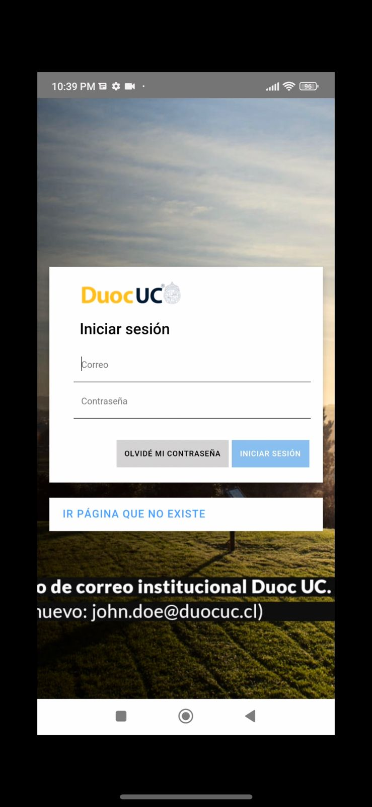

# RegistrAPP

## Tabla de Contenidos
1. [Descripción del Proyecto](#descripción-del-proyecto)
2. [Integrantes del Grupo](#integrantes-del-grupo)
3. [Tecnologías y Frameworks Utilizados](#tecnologías-y-frameworks-utilizados)
4. [Funcionalidades del Proyecto](#funcionalidades-del-proyecto)
5. [APK](#apk)
6. [Enlaces de Repositorios](#enlaces-de-repositorios)

## Descripción del Proyecto
RegistrAPP es una solución innovadora diseñada para facilitar el registro de asistencia de los alumnos en las aulas, especialmente en el contexto de la pandemia. Esta aplicación móvil permite a los alumnos registrar su propia asistencia escaneando un código QR generado por el docente, minimizando errores y optimizando el tiempo dedicado a este proceso.

## Integrantes del Grupo
- Jaime Lopez

## Tecnologías y Frameworks Utilizados
Este proyecto se desarrolla utilizando Ionic Angular, adecuándose a las plataformas Android e iOS. Se han implementado pruebas unitarias para asegurar la calidad del software.

| Angular                                         | Ionic                                    | AndroidStudio                                    |
| ---------------------------------------------- | --------------------------------------------- | --------------------------------------------- |
|  |  |  |

| HTML                                         | JavaScript                                    | TypeScript                                    |
| ---------------------------------------------- | --------------------------------------------- | --------------------------------------------- |
|  |  |  |

| CSS                                         | VSCode                                    | Markdown                                    |
| ---------------------------------------------- | --------------------------------------------- | --------------------------------------------- |
|  |  |  |

| Git                                         | Github                                    | 
| ---------------------------------------------- | --------------------------------------------- | 
|  |  | 

## Funcionalidades del Proyecto
- **Ingreso de Usuario**: Los alumnos y profesores ingresan al sistema utilizando sus credenciales.
- **Generación de Código QR**: El docente genera un código QR para que sus alumnos puedan scanearlo y queden presente en esa materia.
- **Escaneo de Código QR**: Los alumnos utilizan la cámara de sus dispositivos para escanear el código y registrar su asistencia.
- **Envío de Registro de Asistencia**: El registro de asistencia.

 

## APK

[Directiorio APK](https://github.com/jaimeduocuc/skeleton)

## Enlaces de Repositorios

[Repositorio Frontend](https://github.com/jaimeduocuc/skeleton)
[Repositorio API](https://github.com/jaimeduocuc/api)
